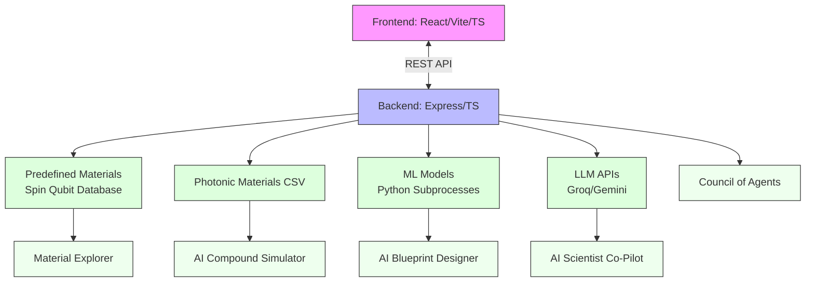

# QuMatForge: Quantum Materials Discovery Engine

## Overview

QuMatForge is a Dual-Mode Quantum Materials Discovery Engine that allows users to explore, predict, and design materials for two distinct quantum technology domains:
1. **Spin Qubits & Color Centers**
2. **Photonic & Continuous-Variable (CV) Quantum Systems**

The application leverages a modern React/Vite frontend and an Express/Node.js backend, powered by the **Groq LLM API (Llama 3.3 70B)** for rapid material property inference and design suggestions.

## Key Features

- **Materials Explorer**: Browse predefined and custom materials with domain-specific stats (T₂ Coherence for Spin Qubits, Squeezing dB for Photonic systems)
- **AI Compound Simulator**: Enter a chemical formula to predict its viability for quantum applications
- **AI Blueprint Designer**: Enter target parameters and let the LLM design a theoretical material tailored to specifications
- **AI Scientist Co-Pilot**: Interactive chat interface powered by Groq's Llama 3.3 70B model for materials science Q&A and predictions
- **Council of Agents**: Multi-model debate system that simulates expert discussion to refine material predictions
- **Mode Toggle**: Seamlessly switch between Spin Qubit and Photonic modes

## Technology Stack

### Frontend
- **React 19** with **Vite 6** for fast development and building
- **TypeScript** for type safety
- **Tailwind CSS 4** for styling
- **Lucide React** for icons
- **Framer Motion** for animations
- **Zustand** (implied) for state management (inferred from usage patterns)

### Backend
- **Node.js** with **Express.js** framework
- **TypeScript** (via `tsx` for execution)
- **Groq SDK** for Llama 3.3 70B LLM access
- **Google GenAI SDK** (Gemini 2.5 Pro) as alternative LLM provider
- **Python** subprocess integration for machine learning models (Scikit-learn, XGBoost)
- **Puppeteer** for web scraping/materials data extraction (inferred)

### Data & Models
- Precomputed photonic materials dataset (`photonic_final_candidates.csv`)
- Predefined spin qubit materials database (hardcoded in `server.ts`)
- Machine learning models for property prediction (stored as `.joblib` and `.json` files)
- Local storage for custom materials persistence

## Development Timeline

Based on git commit history:

### Initial Setup (June 29, 2026)
- `first commit`: Initial project setup with:
  - Basic React/Vite/TS frontend
  - Express/TS backend
  - Core components: MaterialExplorer, MaterialPredictor, MaterialDesigner, LatticeVisualizer, IsotopeSimulator
  - Essential dependencies and configuration files
  - Initial dataset: `photonic_final_candidates.csv`, various qubit material datasets

### Feature Development (July 2026)
- **July 1, 2026**: 
  - Fixed UI crash related to undefined crystalSystem in localStorage cache
  - Added Python setup instructions to README
  - Added ML model files (`model files: model_` and `model_xgb.json`
  - Added training scripts: `train_and_export.py`, `predict.py`
  - Enhanced server.ts with ML integration
  - Added CouncilDebate component
  - Updated MaterialExplorer and MaterialPredictor components

- **July 10, 2026**:
  - Added AI Scientist Co-Pilot chat page with Groq streaming backend (commit 8160ac1)
  - Created new application structure (possibly experimental branch)

- **July 10, 2026**:
  - Fixed Co-Pilot to render JSON material data as styled property cards instead of raw JSON (commit 61e9655)
  - Enhanced AICoPilot.tsx with rich markdown rendering and property card visualization

### Recent Work (July 13, 2026)
- Branch creation and experimentation (commit 5f36723, 0e7fbf3)

## Key Components Explained

### 1. Material Explorer (`src/components/MaterialExplorer.tsx`)
- Displays materials in a grid/card format
- Allows selection of materials to view detailed properties
- Supports both predefined and custom materials
- Shows mode-specific properties (spin qubit vs photonic)

### 2. AI Compound Simulator (`src/components/MaterialPredictor.tsx`)
- Form to input chemical formula, use case, and defects
- Calls backend `/api/predict-compound` endpoint
- Integrates with ML models for property prediction
- Adds predicted materials to custom collection

### 3. AI Blueprint Designer (`src/components/MaterialDesigner.tsx`)
- Form to input target specifications for material design
- Calls backend `/api/design-material` endpoint
- Generates multiple material proposals based on specifications

### 4. AI Scientist Co-Pilot (`src/components/AICoPilot.tsx`)
- Interactive chat interface with streaming responses
- Specialized prompts for spin qubit and photonic modes
- Ability to detect and render JSON material data as styled property cards
- Context awareness of material databases
- Streaming token-by-token response display

### 5. Council of Agents (`src/components/CouncilDebate.tsx`)
- Simulates debate between four AI agents representing different ML models
- Random Forest (pragmatic), Gradient Boosting (aggressive), XGBoost (elite optimizer), and Judge
- Provides explainable AI by showing reasoning process
- Outputs final suitability score and recommendation

### 6. Backend Server (`server.ts`)
- RESTful API endpoints:
  - `/api/predefined-materials`: Returns hardcoded spin qubit materials
  - `/api/photonic-materials`: Returns photonic materials from CSV dataset
  - `/api/predict-compound`: Predicts properties for given chemical formula
  - `/api/design-material`: Generates material designs based on specs
  - `/api/council-debate`: Streams multi-agent debate for material evaluation
  - `/api/copilot-chat`: Streams AI Scientist Co-Pilot responses
- Integrates with:
  - Google GenAI (Gemini) as primary LLM
  - Groq as alternative LLM provider
  - Python subprocesses for ML model inference
  - CSV-based photonic materials database
  - In-memory predefined spin qubit materials

## How to Run the Project

### Prerequisites
- Node.js (v18 or higher)
- npm (comes with Node.js)
- Python (for ML models)
- Groq API key (from [Groq Console](https://console.groq.com/))

### Installation Steps

1. **Clone the repository**
   ```bash
   git clone <repository-url>
   cd QuMatForge
   ```

2. **Install Node.js dependencies**
   ```bash
   npm install
   ```

3. **Set up Python ML environment**
   ```bash
   # Create virtual environment
   python -m venv venv
   
   # Activate it (Windows)
   .\venv\Scripts\activate
   # Or on Mac/Linux: source venv/bin/activate
   
   # Install required packages
   pip install pandas scikit-learn xgboost joblib
   ```

4. **Configure environment variables**
   ```bash
   cp .env.example .env
   # Edit .env to add your Groq API key:
   # GROQ_API_KEY=your_groq_api_key_here
   ```

5. **Ensure data file is present**
   - Verify `photonic_final_candidates.csv` exists in the root directory

6. **Start the development server**
   ```bash
   npm run dev
   ```
   - Frontend: http://localhost:5173 (Vite default)
   - Backend: http://localhost:3000 (Express proxy via Vite)

### Production Build

1. **Build for production**
   ```bash
   npm run build
   ```
   - Creates optimized frontend in `dist/`
   - Bundles backend server to `dist/server.cjs`

2. **Start production server**
   ```bash
   npm run start
   ```
   - Serves application on http://localhost:3000

## Data Sources

### Photonic Materials Dataset
- Source: `photonic_final_candidates.csv`
- Contains pre-calculated properties for potential photonic quantum materials
- Features include: band gap, hull energy, formation energy, density, crystal symmetry, piezoelectric modulus, refractive index, photonic score, predicted squeezing, etc.

### Spin Qubit Materials
- Hardcoded in `server.ts` as `predefinedMaterials` array
- Includes well-known quantum materials:
  - Diamond (NV- Center)
  - Silicon Carbide (VSi Center)
  - Silicon (Phosphorus Donor)
  - Yttrium Orthosilicate (Erbium)
  - Niobium Nitride (NbN)
  - Bismuth Selenide (Bi2Se3)
- Each material includes comprehensive properties:
  - Thermodynamic (band gap, formation energy, Debye temperature)
  - Defect characteristics (for color centers/dopants)
  - Coherence times
  - Synthesis recommendations
  - Scientific reasoning

## Machine Learning Integration

The backend integrates Python-based ML models for property prediction:

1. **Prediction Models** (`model_rf.joblib`, `model_gb.joblib`, `model_xgb.json`):
   - Random Forest, Gradient Boosting, and XGBoost models
   - Predict suitability scores or specific properties based on material features

2. **Training Scripts**:
   - `train_and_export.py`: Trains and exports ML models
   - `predict.py`: Makes predictions using the trained models

3. **Integration Flow**:
   - User submits chemical formula via frontend
   - Backend checks if material exists in photonic CSV database
   - If not found (or for spin mode), invokes Python ML models
   - Model predictions are enhanced with LLM-generated scientific reasoning
   - Final material properties returned to frontend

## Recent Improvements

1. **Enhanced UI Rendering** (July 10, 2026):
   - Replaced raw JSON display in AI Co-Pilot with styled property cards
   - Added markdown rendering for bold/italic text in LLM responses
   - Improved visual presentation of material properties

2. **Robustness Fixes** (July 1, 2026):
   - Fixed crash when crystalSystem is undefined in cached materials
   - Improved error handling in ML prediction pipeline

3. **AI Scientist Co-Pilot** (July 1, 2026):
   - Added streaming chat interface using Groq's Llama 3.3 70B
   - Implemented context-aware responses with material database awareness
   - Added ability to render JSON material data as visual cards

## Future Enhancements

1. **Expanded Material Databases**:
   - Incorporate additional materials from materials project APIs
   - Add more spin qubit defect centers and photonic materials

2. **Enhanced ML Capabilities**:
   - Train models on larger datasets
   - Add uncertainty quantification to predictions
   - Incorporate uncertainty-aware active learning for material discovery

3. **Advanced AI Features**:
   - Multi-modal material generation (text + structure input)
   - Retrospective analysis of prediction accuracy
   - Integration with experimental databases for validation

4. **User Experience Improvements**:
   - Material comparison sidebar
   - Export capabilities (CIF, POSCAR, JSON formats)
   - Collaboration features for research teams
   - Visualization of crystal structures and band structures

5. **Deployment Optimization**:
   - Docker containerization for consistent deployment
   - Kubernetes orchestration for scalable deployment
   - API rate limiting and caching for LLM calls

## Architecture Overview

```
Frontend (React/Vite/TS)  <--->  Backend (Express/TS)
       |                               |
       |-------------------------------|
                       API Calls
       |                               |
   [Material Explorer]        [Predefined Materials]
   [AI Compound Simulator]     [Photonic Materials CSV]
   [AI Blueprint Designer]     [ML Models (Python)]
   [AI Scientist Co-Pilot]     [LLM APIs (Groq/Gemini)]
   [Council of Agents]         [Python Subprocesses]
```

## Data Flow Example: AI Compound Simulator

1. User enters chemical formula in MaterialPredictor form
2. Frontend sends POST request to `/api/predict-compound`
3. Backend:
   a. Checks if formula exists in photonic CSV database
   b. If found, returns exact values from dataset
   c. If not found (or for spin mode):
      - Invokes Python ML prediction script
      - Receives base prediction from ML models
      - 4. Sends prompt to LLM (Groq/Gemini) with:
      - Chemical formula and use case
      - ML predictions (if available)
      - System prompt for expert materials scientist role
   5. LLM generates detailed material properties in JSON format
   6. Backend returns JSON response to frontend
4. Frontend:
   - Parses JSON response
   - Adds material to custom materials list (localStorage)
   - Optionally displays as property card in AI Co-Pilot chat

## Challenges and Lessons Learned

Throughout development, several key challenges were overcome:

1. **State Management Issues**: Early versions experienced crashes when accessing undefined properties like `crystalSystem` from cached materials in localStorage. This was resolved by adding proper null-checks and default values.

2. **ML Model Integration**: Integrating Python-based ML models with the Node.js backend required careful handling of subprocess execution, data serialization, and error handling. The solution involved creating robust wrapper functions that gracefully fall back to default predictions when ML models fail.

3. **Streaming UI Updates**: Implementing the AI Scientist Co-Pilot's real-time token-by-token display while maintaining responsiveness required careful state management and efficient DOM updates using React's concurrent rendering capabilities.

4. **Cross-Mode Consistency**: Maintaining consistent data structures and UI components between Spin Qubit and Photonic modes required designing flexible TypeScript interfaces and mode-aware components.

5. **Performance Optimization**: Balancing the computational load of LLM calls with responsive UI interactions led to implementing streaming responses and optimistic updates for material additions.

## Future Roadmap

### Short-Term (Next 3 Months)
- Implement material export functionality (CIF, POSCAR, JSON formats)
- Add visualization tools for crystal structures and band structures
- Enhance the Council of Agents with more specialized AI personas
- Add user authentication and project saving capabilities

### Medium-Term (3-6 Months)
- Integrate with experimental materials databases for validation
- Develop collaborative features for research teams
- Implement uncertainty quantification in ML predictions
- Add multi-modal input capabilities (structure + text prompts)

### Long-Term (6+ Months)
- Deploy as a cloud service with scalable infrastructure
- Integrate with quantum hardware simulators for end-to-end workflow
- Develop educational modules and tutorials for quantum materials science
- Expand to other quantum computing domains (topological qubits, etc.)

## Architecture Diagram



## Conclusion

QuMatForge represents a sophisticated integration of modern web technologies, machine learning, and large language models for accelerated quantum materials discovery. By combining rule-based databases, ML predictions, and LLM reasoning, the platform provides both accurate data retrieval and creative hypothesis generation for quantum materials researchers.

The project demonstrates a full-stack approach to scientific AI applications, with careful attention to user experience, interpretability (through Council of Agents), and extensibility for future enhancements. The development journey highlighted important lessons in state management, ML integration, and real-time UI updates that will inform future versions of the platform.